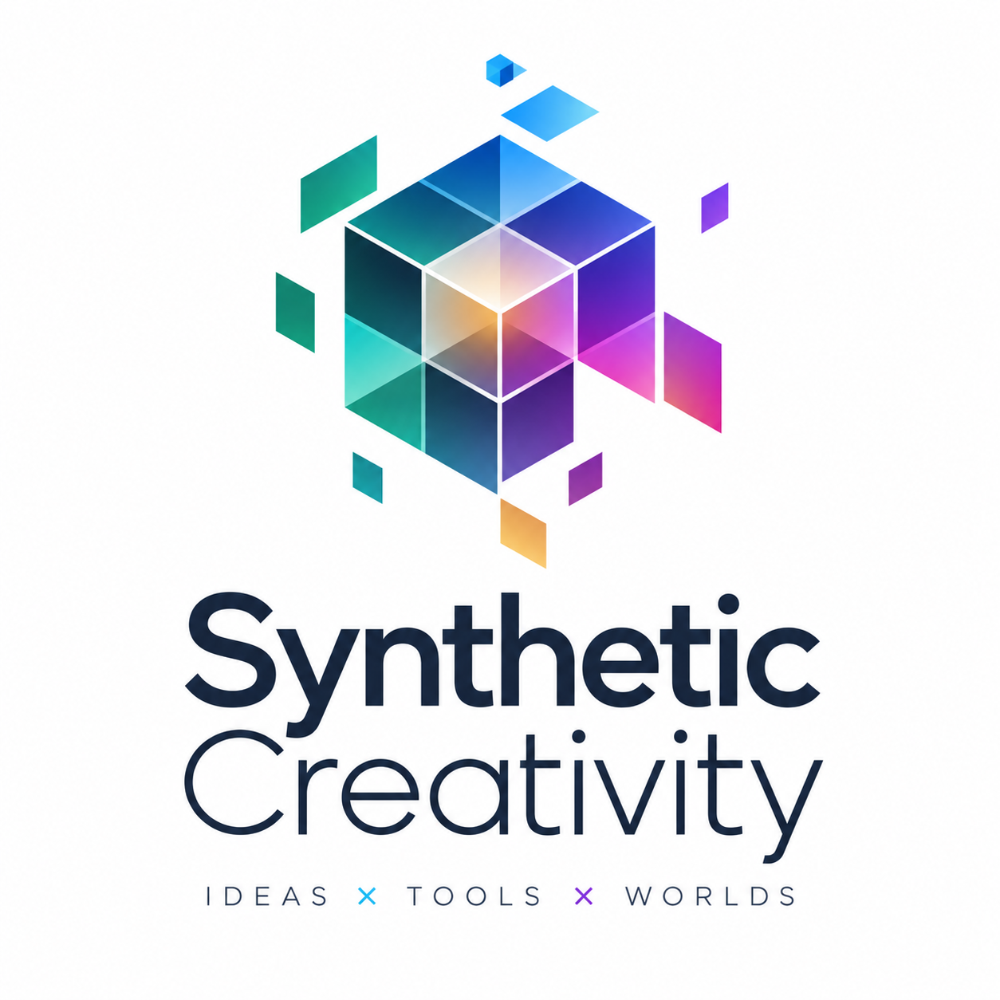

  

# Synthetic Creativity

**Ideas × Tools × Worlds.**

Synthetic Creativity is an experimental platform for generating new ideas by systematically combining fields of knowledge, methods, concepts, and ways of thinking. It makes unexpected connections visible and navigable, turning recombination into a deliberate practice of exploration and play.

## Explore the matrix and cube

The project begins with academic disciplines, from anthropology and architecture to music, philosophy, and data science.

- **2D Matrix (A × B):** Cross two disciplines to discover questions, methods, and potential projects.
- **3D Cube (A × B × C):** Combine three disciplines, letting each supply a method, domain, context, constraint, or new perspective.
- **Z-slice grid:** Explore three-way combinations as a stack of two-dimensional layers.

With the default 50 disciplines, the matrix offers 2,500 ordered pairs and the cube contains 125,000 ordered three-way combinations, including repeated disciplines. Order matters because disciplines can take different roles.

For example:

> Design a project in which Anthropology provides the method, Game Studies provides the domain, and Architecture provides the context, audience, or ethical complication.

The aim is to uncover questions that no single discipline would naturally formulate alone. Combinations are starting points for inquiry, not guarantees of useful ideas.

## Getting started

1. Download this repository using **Code → Download ZIP**, then extract it, or clone it with Git.
2. Open [`synthetic_creativity_cube_grid.html`](synthetic_creativity_cube_grid.html) in a modern web browser.
3. Drag the cube to rotate it, scroll to zoom, and click a face or use **Random point** to select a combination.
4. Explore cutaway depth and Z slices, or switch to **2D Matrix** for pairwise prompts.
5. To explore your own subjects, edit the **Subjects — one per line** list in cube mode and click **Build Matrix**.

The interactive tool is a standalone HTML file with embedded CSS and JavaScript. No installation, build process, server, or API key is required. Prompts are generated from built-in templates; the current tool does not call an AI service. Subject edits apply to the current page session.

## Project files

| File | Description |
| --- | --- |
| [`synthetic_creativity_cube_grid.html`](synthetic_creativity_cube_grid.html) | Interactive cube, Z-slice grid, and two-dimensional matrix. |
| [`Synthetic Creativity.rtf`](Synthetic%20Creativity.rtf) | Original project overview and conceptual background. |
| [`synthetic-creativity-logo.png`](synthetic-creativity-logo.png) | Project logo. |

## Conceptual background

The project overview situates Synthetic Creativity within a tradition of combinational thought: Fritz Zwicky’s morphological analysis, Arthur Koestler’s bisociation, Margaret Boden’s combinational creativity, and Gilles Fauconnier and Mark Turner’s conceptual blending. The interactive HTML includes a further-reading list.

## Future directions

The matrix and cube are a starting point. Possible extensions include combinations with technologies, historical periods, geographic regions, populations, media, ethical frameworks, and research methods; a four-dimensional creativity hypercube; and AI-assisted exploration of more complex conceptual spaces.

Synthetic Creativity is a framework for structured intellectual experimentation: cultivating creativity through recombination, juxtaposition, exploration, and play.
